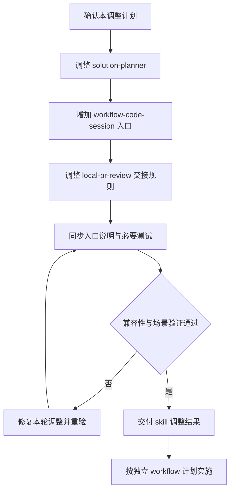
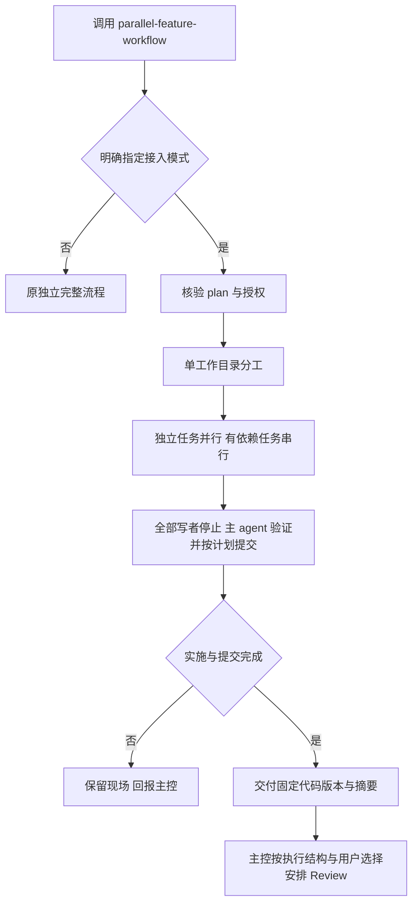

# Skill 调整计划 v1

## 1. 结论与状态

先调整现有三个 skill，再实施[任务 Workflow 计划](workflow-plan-v1.md)。本计划只规定 skill 的调整，不启动业务任务或修改远端。

- 依据：用户最初的 workflow 设计，以及本次对话逐项确认的修订。
- 已确认方向：单工作目录；Review 由 workflow 主控调度；轻量方案也具体到代码；代码按 plan 拆分本地 commit；自动模式默认批准合格 plan；未经明确授权不得修改远端或 push。新增简略模式，在当前 session 内由主 agent 讨论并制定详细 plan、子 agent 实施，Review 方式由用户选择。
- 版本：`skill-adjustment-v1.1`；本次增补简略模式接入，沿用原文件名。
- 决策状态：待用户确认实施；生成本文不表示已经修改 skill。
- 审查记录：前一轮独立 Plan Review 已检查 v1 调整方向，发现的问题已纳入。v1.1 根据用户确认增加简略模式，新增部分进行文档一致性核对，不沿用旧版本的独立审查结论证明新内容已审查；文档核对不代替实现或真实运行验证。
- 实施范围：当前仓库中的三个 skill、相关入口说明和必要测试。安装到用户技能目录另行处理。

## 2. 目标与边界

第一版优先简略可用，不重写现有编排框架。新增明确的 `workflow-code-session` 接入模式；原有独立完整流程继续保留。

该接入口同时用于多 session 中的 code session，以及简略模式中当前 session 的编码阶段；名字不表示必须创建独立 session。简略／多 session 是执行结构，自动／非自动是交互方式，两者独立。未指定结构时由主 agent 推荐并等待确认，明确指定时直接采用；该入口选择规则由外层 workflow 负责。

| 能力 | 调整后的归属 |
| --- | --- |
| 需求、方案内容、方案质量及版本 | `solution-planner` |
| session 创建、阶段切换、整体状态、模式与重试决策 | 外层 workflow 主控 |
| code 内部任务拆分、文件所有权、编码、测试、本地提交 | `parallel-feature-workflow` 的新接入模式 |
| 固定提交范围的五视角审查及汇总 | `local-pr-review` |
| 简略模式下用户选择 Codex 原生单次 Review | workflow 调用实际原生能力，不修改或冒充 local-pr-review 内部流程 |
| 修哪些问题、是否安排修复和复审 | 主控；非自动模式由用户选择，自动模式按预设规则 |

第一版不新增跨 worktree 接入，不修改原完整流程的状态 schema、manifest 或大型交付校验器，不实现定时调度器，不自动安装 skill。



## 3. 现状与必要修订

| 现有规则与证据 | 问题 | 最小调整 |
| --- | --- | --- |
| `solution-planner/SKILL.md` 的轻量方案和完整交接章节 | 轻量方案的代码精度不够明确；接入 parallel 一律要求完整契约 | 明确代码级方案要求；将旧完整交接限制限定为原独立完整流程 |
| `solution-planner/references/full-plan.md` 的确认流程 | 主要描述逐版本确认，未说明 workflow 预授权 | 接受主控引用真实预授权批准当前版本，保留质量门禁 |
| `parallel-feature-workflow/SKILL.md` 的核心流程 | 同时负责实现、Review、修复和集成，与外层主控重叠 | 在入口处分流，新模式只负责 code 阶段 |
| `parallel-feature-workflow/agents/openai.yaml` 的默认提示 | 无条件导向完整交付流程 | 增加模式识别，避免新入口又回到旧流程 |
| `local-pr-review/SKILL.md` 的范围确认规则 | 未明确 workflow 自动批准的传递方式 | 允许真实预授权与确切 plan/scope 组成确认依据 |
| 三个 skill 的模型配置参考 | strict 内置角色预设可能覆盖 workflow 偏好 | 明确用户具体指令优先，其次 workflow 配置，再按原有默认规则解析 |

上述是文档事实与设计措施；尚无新模式运行证据。

## 4. STEP-1：调整 solution-planner

### 修改位置

- `solution-planner/SKILL.md`：轻量方案、完整交接、Agent 配置。
- `solution-planner/references/plan-template.md`：轻量模板、实施步骤、确认依据、commit 拆分。
- `solution-planner/references/full-plan.md`：批准来源、独立审查修订、最终输出。
- `solution-planner/references/quality-gates.md`：实施精度、配置来源和批准依据的一致性。
- `solution-planner/references/agent-roster.md`：workflow 配置与 strict 预设优先级。

### 行为变化

输入为主控交接的需求、问题结论、约束、执行结构、交互方式和授权依据；简略模式由当前主 agent 直接整理输入并制定详细 plan，不另建 Planner 或 plan session。输出为可直接实施的方案、确切版本、Plan Review 结论、批准状态和 commit 计划。

1. 轻量方案也必须写清文件与函数/类/配置键等位置、具体修改逻辑、相关调用关系、输入输出、必要字段或变量、正常/失败/边界行为、事实前提、禁止范围、验证与恢复方式。文档任务使用章节、规则和前后语义代替代码函数。
2. 不强制粘贴完整代码；允许 Coder 决定不改变语义的局部命名与等价写法。影响行为的设计不能留到编码时决定。
3. 每个 commit 指定范围、对应步骤、依赖顺序、提交前验证及中文说明。小任务允许一个 commit。
4. workflow 内即使是轻量方案，也执行独立方案审查：多 session 由 plan session 协调，简略模式由当前主 agent 派发 Plan Reviewer 子 agent，不另建 session。独立使用 skill 时继续按风险选择审查深度。简略执行结构不等于轻量方案，必须保留详细实施语义。
5. 首次审查发现问题后修订一次；复审仍有阻断问题时交回主控。非阻断建议如实记录，不因风格偏好无限循环。此轮次规则不降低高风险方案的必需审查覆盖。
6. 自动模式：无关键质量阻塞、未越出用户需求和预授权边界时，主控批准确切版本；保留用户预授权来源，不能伪称用户逐版确认。
7. 非自动模式：将合格方案交回主控，请用户确认后才能编码；简略模式由当前主 agent 直接展示并请求确认。
8. 实质修改形成新版本并重新检查受影响部分；自动模式仍按预授权边界批准，非自动模式重新确认。
9. 低风险代码级轻量方案可以进入 `workflow-code-session`；高风险任务仍完整规划。原独立完整编排仍要求完整 Planning Handoff。

前提：需求来源可定位，无影响设计方向的未决问题。前提失效时停止受影响步骤并回报，不由 Coder 补造决策。

验证：检查轻量示例是否无需重新设计即可实施；分别演练自动批准、非自动等待、越界阻断和复审仍不通过。回退：撤销本步新增规则，保留原方案流程；实际文件回退须遵守授权。

## 5. STEP-2：增加 code session 接入模式

### 修改位置

- `parallel-feature-workflow/SKILL.md`：在完整流程前增加明确入口分流，界定后续章节适用范围。
- 拟新增 `parallel-feature-workflow/references/workflow-code-session.md`：集中记录新模式契约。
- `parallel-feature-workflow/references/agent-dispatch.md`：模型配置和新模式内部职责。
- `parallel-feature-workflow/agents/openai.yaml`：同步入口提示。

### 行为变化

调用方必须明确指定接入模式；不能仅因出现“自动”或“并行”二字就绕过原流程。新模式从入口直接读取专属参考，不先进入旧状态机再跳过门禁。

多 session 模式的 code 主 agent 负责调用；简略模式由当前主 agent 在编码阶段调用。下文“code 主 agent”在简略模式中就是当前主 agent；全局调度和编码协调是同一 agent 的不同职责，不要求发送消息给自己。



输入至少包含任务标识、执行轮次、plan 版本与正文入口、批准依据、目录、允许修改范围、commit 计划、验证要求、模型配置和禁止动作。

1. 仅使用一个工作目录；每个文件有唯一写入负责人。依赖方等上游完成并验证约定结果后再执行，不能仅靠“启动了”解除依赖。
2. 只有 code 主 agent 操作 Git；子 agent 只在分配路径内编码并回报。暂存和提交按 commit 顺序串行进行。
3. 提交窗口和最终验证窗口先确认所有 Coder 停写；只暂存本次计划内的精确修改。不同 commit 需要修改同一文件且无法可靠分离时，按 commit 顺序编码和提交，不混合后再猜测拆分。
4. 任务开始时发现用户既有未提交改动、其他任务写者或无法核实的状态，回报主控；不得自动 stash、reset、覆盖或删除。
5. 按计划完成本地 commit，并记录完整提交 ID、顺序和 HEAD。中文 commit 信息；失败或提交不完整不能交付为可审查完成状态。
6. 修复仅接受主控的新指令：非自动模式携带用户选择的修复项；自动模式携带符合既定规则的修复项。修复完成产生新提交，再交回主控。
7. 多 session 模式下主控维护全局阶段，code 主 agent 只维护内部子任务状态，不自行安排 Review 或修复。简略模式中当前主 agent 先完成编码协调，再按 workflow 主控职责进入用户选择的 Review 或修复阶段；编码接入规则本身不内置 Review 或修复循环。
8. 输出五项结果摘要，并附目录、基线与 HEAD、commit 清单、验证结果、计划偏差和工作区状态。不得声称已通过尚未执行的 Review。
9. 原完整流程的状态机、模板与校验器保持原用途；新模式不调用这些校验器来证明完整交付，也不输出 `MERGE_READY`。

前提：STEP-1 的方案与授权契约已明确，实际后台支持所需子 agent。验证：共享文件串行、Git 单写者、提交窗口停写、脏工作区阻断、计划前提失效上报。回退：停用新入口，恢复原入口提示；保留已产生的业务提交与现场。

## 6. STEP-3：调整 local-pr-review

简略模式的 Review 方式由用户决定，建议与执行结构一起确认。选择 `local-pr-review` 时执行本步骤的完整规则；选择 Codex 原生单次 Review 时由 workflow 调用已核验的原生入口，不进入该 skill，也不削减该 skill 的五视角来模拟单次审查。原生能力不可用时报告缺口，请用户决定，不静默替换。

### 修改位置

- `local-pr-review/SKILL.md`：范围确认、workflow 输入、审查结果与修复交接。
- `local-pr-review/references/agent-configuration.md`：workflow 配置覆盖关系。

### 行为变化

1. 接收主控转发的完整基线材料、批准依据、目录、固定 base/head 和模型配置；有 plan 用 plan，没有则使用用户已确认的需求或 issue 范围。
2. 自动模式下，真实用户预授权加主控对确切 plan/scope 的批准可作为 `confirmation_basis`；范围完整一致时不再要求逐版用户确认。缺失、冲突或越界仍暂停。
3. 继续要求固定已提交差异和规定的工作区状态；Review 期间不得有写者。
4. 保留五视角、独立汇总、归因规则和严重度阈值，不重复创建另一组 Reviewer。
5. 输出“执行是否完整”和“有无阻断问题”两项结论。发现问题不等于工具执行失败，也不等于审查通过。
6. Review 只读；多 session 由 review session 汇报，简略模式由当前主 agent 汇总，修复均按主控职责处理。新 HEAD 必须重新审查，范围不变时可保持相同 `scope_id`。

无需修改 Review 报告 schema 或审查算法，现有报告结果由 session 主 agent 汇总为 workflow 摘要。独立使用时保留现有规则。

原生单次 Review 同样需要明确的需求／plan 范围、固定 base/head、只读约束、执行完整性与问题报告；如实说明实际覆盖，不套用未执行的五视角或 `scope_id` 协议。非自动模式由用户选修复项，自动模式按已确认规则处理；修复后使用所选方式复审。这些路由要求写入 workflow，不改现有 Review 算法。

验证：自动确认依据可传递；未确认或冲突范围不启动审查；五视角完整；修复后旧结论失效。回退：撤销接入说明，保留原只读 Review 能力。

## 7. STEP-4：同步入口、验证与交付

### 修改范围

- `README.md`：补充三 skill 与外层 workflow 的职责、两种执行结构及确认入口、Review 选择、自动预授权及本地提交边界。
- `solution-planner/agents/openai.yaml`、`local-pr-review/agents/openai.yaml`：仅同步确实冲突的入口描述。
- `parallel-feature-workflow/tests/test_skill_contract.py`、`local-pr-review/tests/test_skill_contract.py`：仅调整受入口语义变化影响的检查，补充新模式关键边界，不删除原完整模式要求。
- 不因纯文字改动新增大量逐字匹配测试，不改无关格式与空行。

### 验收项

| 编号 | 验收标准 | 对应步骤 |
| --- | --- | --- |
| S-AC1 | 轻量计划明确代码修改、行为边界、验证和 commit 拆分 | STEP-1 |
| S-AC2 | 自动批准有可核对依据；非自动确认、越界与质量阻断有效 | STEP-1、STEP-3 |
| S-AC3 | 新旧入口不混用；阶段由 workflow 主控决定，简略模式不创建独立 phase session | STEP-2、STEP-4 |
| S-AC4 | 单工作区分工明确，Git 单写者，全部计划内提交后才交接 Review | STEP-2 |
| S-AC5 | Review 固定版本、只读；local-pr-review 保留五视角，原生单次由用户选择并如实标明覆盖；修复由主控安排 | STEP-3 |
| S-AC6 | workflow 模型覆盖 strict 预设，用户具体配置优先，实际能力仍核验 | STEP-1～3 |
| S-AC7 | 原有独立完整流程及现有校验器不被放宽 | STEP-2、STEP-4 |
| S-AC8 | 默认无远端修改，完成报告不夸大授权、测试或审查结果 | 全部 |
| S-AC9 | code 接入口兼容两种结构；简略模式主 agent 直接制定详细 plan，子 agent 实施 | STEP-1、STEP-2 |
| S-AC10 | 未指定结构先推荐并等待确认；明确指定直接采用；Review 方式由用户选择 | STEP-3、STEP-4，外层 workflow 验证 |

实施后计划运行以下测试；本文生成时未运行：

```bash
python3 -m unittest discover -s solution-planner/tests -v
python3 -m unittest discover -s parallel-feature-workflow/tests -v
python3 -m unittest discover -s local-pr-review/tests -v
```

另用工作流场景人工核对：执行结构推荐与确认、用户明确指定、简略模式两种 Review 路由、自动批准、非自动确认、用户选择修复、自动修复边界、计划变更、提交失败、共享目录已有改动、旧结果迟到、未授权远端操作。文档检查和模拟测试不替代之后真实 session 的试运行。

### 调整工作的建议提交拆分

获得本次 skill 实施与 Git 授权后，可按以下顺序提交；未授权前不执行：

1. `完善方案精度与工作流批准规则`：STEP-1 及对应说明。
2. `增加单工作目录编码会话接入模式`：STEP-2 及对应契约测试。
3. `衔接工作流审查并同步使用说明`：STEP-3～4。

## 8. 主要失败场景与处置

| 失败场景 | 预防与处置 |
| --- | --- |
| 入口提示重新触发旧完整流程 | 主文档先分流，并同步 YAML；发现混用停止接入验证 |
| plan 默认批准被误解为无限授权 | 绑定任务、范围、模式和版本；远端写入单独授权；越界交主控 |
| 并行写入污染 commit 或最终测试 | 文件唯一负责人、主 agent 统一 Git、全体停写窗口 |
| Review 忽略预授权又等待用户，或直接伪造确认 | 明确来源与确切版本，缺少真实依据才阻断 |
| 文档通过但运行环境不支持跨 session 监控 | 在 workflow 实施阶段执行能力验证，不以本计划证明运行可用 |

## 9. 完成条件

三个 skill 的规则与入口一致、必要测试通过、场景核对无明显冲突，才交付 skill 调整结果。随后按另一份 workflow 计划实施外层编排。当前文件只是计划，不表示 skill 已更新、已安装或 workflow 已可运行。
