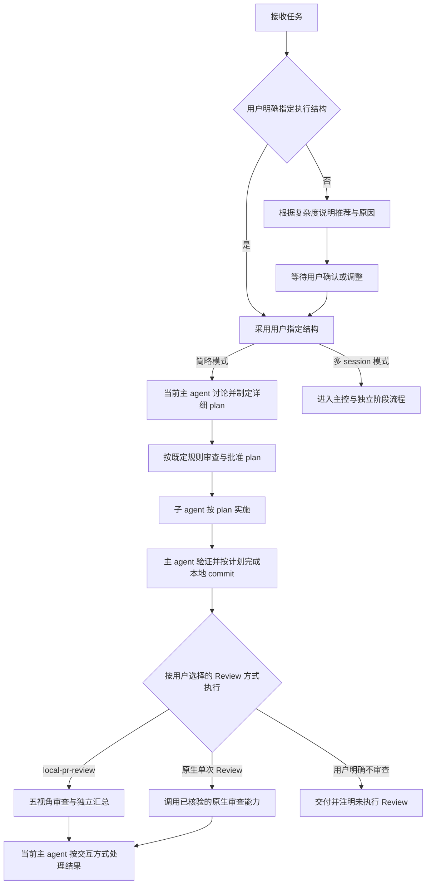
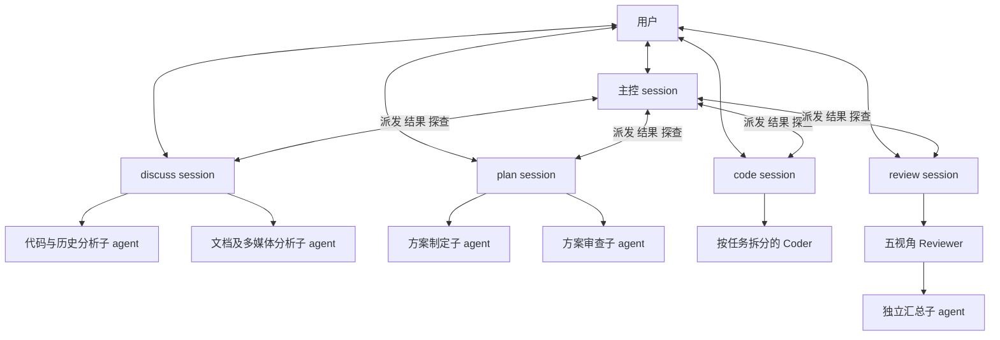
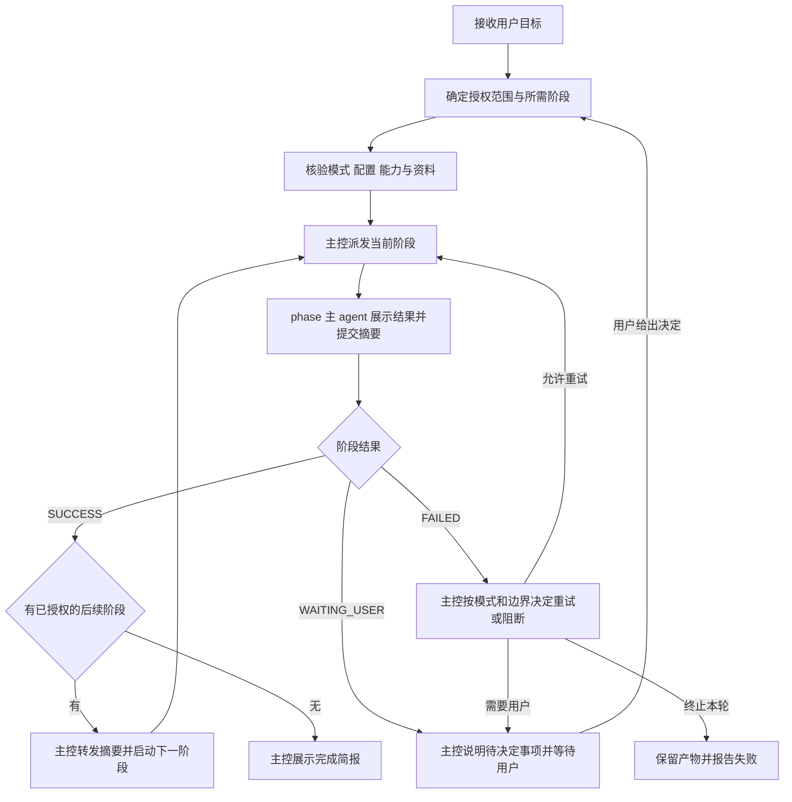
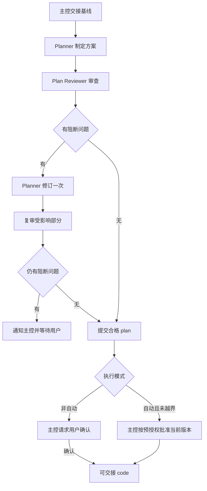
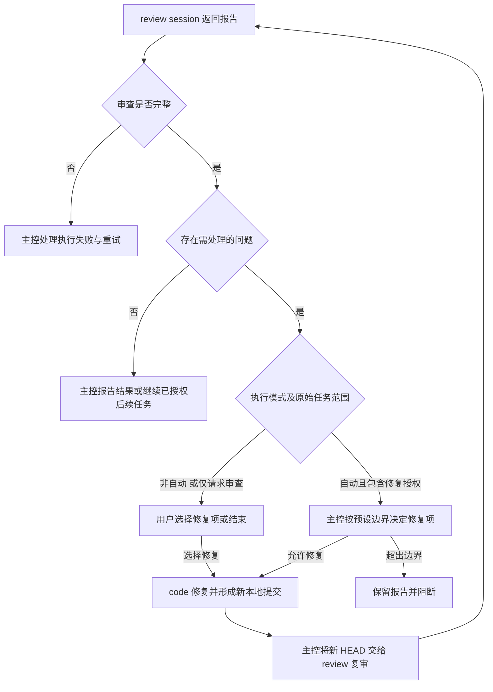
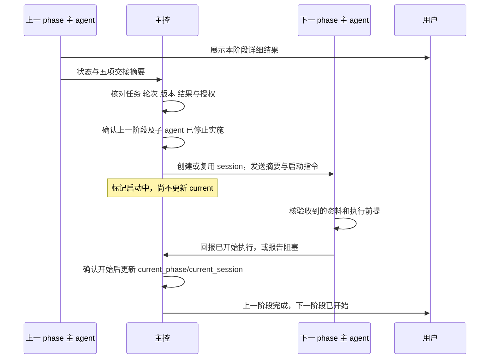
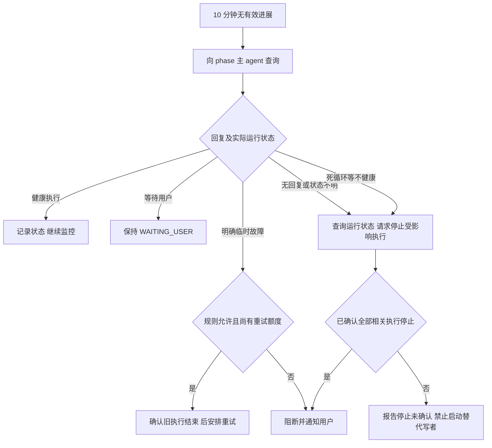

# 任务 Workflow 设计与实施计划 v1

## 1. 目标、依据与状态

以用户最初提供的“主控 session＋discuss／plan／code／review session”设计为主体，纳入本轮讨论的确认结果。第一版以能够正常使用、无明显流程问题为目标，不设计复杂交接 schema 或跨 worktree 编排。

- 版本：`task-workflow-v1.1`；本次增补简略模式，沿用原文件名以保持链接稳定。
- 本文是设计和实施计划，尚未实施或完成真实 session 试运行。
- 前置依赖：[Skill 调整计划](skill-adjustment-plan-v1.md)完成并验证。
- 已确认业务规则按下文执行；文中标为“建议默认值”或“待能力验证”的事项不是用户已经确认的配置或已实现能力。
- 默认非自动模式。自动模式必须由用户明确选择，例如“按规则一直把任务做完”。
- 执行结构分为简略模式（单 session）和多 session 模式，与自动／非自动两种交互方式独立。用户明确指定结构时直接采用；未指定时先推荐并等待用户确认或调整。
- 本次只产出方案文档，不创建业务 session、不启动自动化、不修改三个 skill。

## 2. 整体结构

### 2.1 执行结构选择

先选择执行结构，再按任务范围选择所需阶段。简略模式只减少 session 编排，不降低详细 plan、实施、提交和验证要求，也不等于 `solution-planner` 的轻量方案。

| 情况 | 推荐执行结构 | 原因 |
| --- | --- | --- |
| 目标集中、依赖少、一个主 agent 容易持续掌握上下文 | 简略模式 | 在当前 session 完成讨论、规划、子任务实施和审查协调 |
| 跨模块依赖多、排查和规划跨度大、需要阶段隔离或长期恢复 | 多 session 模式 | 复用原有主控和独立阶段 session 的职责分工 |

不单凭文件数判断。用户未指定时，主 agent 简述推荐结构、理由及影响，等待用户确认或调整后再进入正式阶段；必要的只读范围判断可以先进行。用户明确指定结构时不重复索要结构确认，其他尚未决定的配置和授权仍按规则处理。用户只说“自动完成”不等于指定执行结构。

简略模式需要 Review 时，由用户选择 `local-pr-review` 或 Codex 原生单次 Review；尽量与结构选择一并确认，不能在用户未选择时静默使用某一种。用户已明确不用 Review 的任务保留原停止点。

图中简略模式展示实现任务的完整路径；仅讨论、仅制定方案或仅审查时，仍按第 3 节只执行请求范围内的阶段。

### 2.2 简略模式：一个 session 内完成

- 当前主 agent 兼任全局主控和各阶段协调者，直接与用户讨论并制定详细 plan；不创建独立 discuss、plan、code 或 review session，也不为制定 plan 再创建 Planner。
- 必要的独立 Plan Reviewer 仍使用子 agent，沿用方案质量、修订次数和确认规则。明确要求严格实施规格时仍满足相应要求。
- 编码交给子 agent，当前主 agent 复用 code 接入规则组织文件所有权、依赖、停写窗口、验证和本地提交。
- 使用 `local-pr-review` 时保持该 skill 的五视角和独立汇总；使用原生单次 Review 时执行一次原生审查，不宣称完成五视角覆盖，也不再调用一套 `local-pr-review`。
- 两种代码审查都接收明确的需求／plan 范围和固定 base/head，保持只读；报告实际覆盖、执行完整性及问题。原生能力无法满足要求时说明缺口，由用户决定，不能用主 agent 自检冒充原生 Review。
- 非自动模式发现问题后由用户选择修复项；自动模式按已确认的修复、重试和阻断规则处理。修复产生新 HEAD 后使用所选方式复审。
- 保留唯一任务记录和阶段摘要；`current_session` 在实际执行阶段指向当前 session，不创建虚拟 phase session。等待用户或没有实际执行阶段时仍按第 7 节置空。
- 跨 session 创建、交接和对 phase 主 agent 的探查不适用；主 agent 直接检查自己的子 agent 和在途命令。重试次数、停止确认及不得重复启动写者的规则继续适用。主 agent 本身挂起时不能声称仍可自我探查，持续监控能力按实际后端验证。

结构选择不影响用户已设定的模型偏好。简略模式主 agent 保留当前 session 的模型，不因阶段变化自行切换；Coder、Plan Reviewer 及 `local-pr-review` 子 agent 沿用对应角色配置。原生单次 Review 的模型可配置性须核验，不假装可使用五视角子 agent 的配置。

执行中发现新的关键风险或能力不支持时，先说明具体问题；需要切换执行结构时取得用户决定，不静默切换，也不通过换结构重置重试计数。

### 2.3 多 session 模式：原有结构

每个 session 都有可接收用户消息的主 agent。主控负责全局调度；phase session 负责自己的阶段，可以在职责范围内直接与用户讨论。每个任务同一时间最多有一个正在执行的 phase session；phase 内部允许受控的子 agent 并行。

图中多个 phase 是可选阶段，并非同时执行。独立汇总在各 Reviewer 完成后启动，不额外增加一套重复审查。

### 职责边界

- 主控：理解目标、选择阶段、确认模式与授权、创建或复用 session、转发摘要、管理唯一全局状态、探查、决定重试／阻断／下一步。
- phase 主 agent：接收用户和主控消息，协调本阶段子 agent，展示详细结果，向主控返回简报和交接摘要。
- 子 agent：完成有界任务，向本阶段主 agent 汇报；不决定全局需求、模式或阶段切换。
- 全局目标、范围、模式、是否继续等变更必须通知主控。收到变更后暂停受影响工作，不能一边上报一边按过时需求继续修改。
- phase 可以处理职责内、未改变已批准语义的局部问题；不能以局部讨论扩大任务范围。

## 3. 入口与阶段选择

下表是两种执行结构共同的任务范围路由。简略模式在当前 session 内依次执行对应阶段，多 session 模式派发独立 phase session；不因结构选择增加未请求的阶段。

| 用户请求 | 所需阶段 | 停止点 |
| --- | --- | --- |
| review 一下某项改动 | review | 报告审查结果；不能自行扩展为修复 |
| 排查某个问题 | discuss | 给出排查结果，等待后续指令 |
| 按照已有 plan 实现 | code → review | 按模式处理 Review 结果 |
| 查看 plan 有无问题，无问题则实现 | plan → code → review | plan 不通过时按规则上报 |
| 按照需求做 plan 并实现 | discuss → plan → code → review | 完成已授权任务或触及阻断边界 |
| 按照需求做 plan | discuss → plan | 交付方案，不进入 code |
| 按 plan 实现，不用 review | code | 交付实现、验证及本地 commit，不声称已审查 |

主控根据实际信息选择阶段；不为凑流程重复已完成的需求讨论。仅分析或审查请求不自动获得编码权限。

以下图示为多 session 调度；简略模式由当前主 agent 在本 session 内执行同样的结果决策，不发送跨 session 指令。

## 4. 两种交互方式与授权

本节自动／非自动规则同时适用于简略模式和多 session 模式。简略模式中的“主控”就是当前主 agent。

| 项目 | 非自动模式 | 自动模式 |
| --- | --- | --- |
| 使用假设 | 用户在，可及时讨论 | 用户不在，按预设规则尽量完成 |
| 普通阶段切换 | 在用户已授权任务范围内由主控推进 | 在用户已授权任务范围内由主控推进 |
| plan 审查通过 | 主控通知用户确认，再进入 code | 符合需求与边界时默认批准，再进入 code |
| Review 发现问题 | 展示结果，由用户选择修复项，再修复 | 主控按预设修复规则安排 code 和复审 |
| 无法自行决定 | 与用户交互；需要决定时返回 WAITING_USER | 规则可决定则执行，否则 WAITING_USER，等用户回来 |
| 超时与重试 | 主控探查，并在需要时与用户讨论 | 严格按用户确认的超时、重试和阻断规则执行 |

自动模式不是无限重试，也不是任意扩张需求。用户已确认自动模式配置后，不再为普通阶段切换重复索要确认。

### 启动配置

自动模式开始前，主控展示：执行结构、预计阶段、Review 方式、所有角色模型与推理强度、人数与并发、修复和重试边界、超时探查方式、卡死处理原则、授权范围。用户可以直接确认或修改后再开始；已明确指定的项目不重复询问。

进入 code 阶段的授权应明确包含计划内源码修改、必要只读 Git 检查、按 plan 拆分的本地暂存与 commit；已有明确授权可复用。不能从“plan 已通过”单独推导出其他 Git 权限。

默认不允许 push、创建或修改远端 PR／评论、发布或其他远端内容修改。此类动作必须得到明确授权。全局范围、不可逆操作和计划外动作仍受用户规则约束。

## 5. 模型与并发

以下独立 session 的配置适用于多 session 模式；简略模式保留当前主 agent，并按第 2.2 节复用适用的子 agent 配置。

### 配置优先级

1. 用户本次对具体 session 或角色的明确配置。
2. 用户手动创建的 session 主 agent 保留其所选模型；自动创建的 session 使用下表。
3. phase 内子 agent 使用 workflow 角色配置。
4. 未指定字段继承相应当前配置，并核验兼容性；无法解析时说明，不伪造实际配置。

workflow 角色配置覆盖 `strict-plan-execution` 内置模型预设，但不取消严格实施规格和偏差处理。实际模型必须由当前派发后端核验；不可用时按用户预先允许的替代规则处理，没有替代授权则停止相关派发。

| session／角色 | 自动创建时的模型 | 推理强度 | 依据 |
| --- | --- | --- | --- |
| 主控主 agent | `gpt-5.6-sol` | `high` | 用户原始设计；通常主控由用户创建并沿用选择 |
| discuss 主 agent | `gpt-5.6-sol` | `high` | 用户原始设计 |
| discuss 子 agent | 继承 discuss 配置 | 继承 | 原设计未单列子 agent 配置，作为第一版建议默认值 |
| plan 主 agent | `gpt-5.6-sol` | 建议 `high` | 用户指定模型，未单独指定强度；启动配置中确认 |
| Planner／Plan Reviewer | `gpt-6-astra` | `medium` | 用户原始设计 |
| code 主 agent | `gpt-5.6-sol` | `high` | 用户原始设计 |
| Coder／Fix | `gpt-5.6-terra` | `high` | 用户原始设计及相同编码职责 |
| review 主 agent | `gpt-5.6-sol` | `high` | 用户原始设计 |
| Reviewer／独立汇总者 | `gpt-6-astra` | `medium` | 用户确认 astra，review 其他子 agent 使用该配置 |

同任务仅一个 phase 执行。discuss 按材料需要最多使用代码和非代码两类子 agent；plan 制定与审查有先后依赖；code 按独立任务和后端容量限制并发；review 保留五视角，容量不足时分批。跨任务不得同时写同一个工作目录。

## 6. 各阶段规则

下文描述原有多 session 阶段分工。简略模式由当前主 agent 直接承担 discuss 和 Planner 职责，复用方案审查、编码与本地提交规则；代码 Review 按第 2.2 节的用户选择执行。

### 6.1 discuss：排查与需求讨论

主 agent 协调代码／commit 分析与文档、图片、视频等材料分析；没有相应材料时不为凑人数创建子 agent。

- 排查：尽力复现、定位代码和引入问题的 commit，提供可核对证据；区分事实、推断和未验证内容。环境或历史缺失时报告缺口，不编造结论。
- 需求讨论：明确目标、范围、约束、验收和潜在不合理要求；不强制执行 bug 复现。
- 同一问题连续重复尝试而没有新证据、代码变化或测试结果时，不无限尝试，返回 WAITING_USER 并通知主控。
- 如果任务明确要求查清根因和复现，而只得到推测，不能报 SUCCESS。

输出：最终需求或排查结论、证据、未决项、建议下一步。用户只要求排查时，到此停止。

### 6.2 plan：制定与审查方案

主 agent 接收基线、协调 Planner 和 Plan Reviewer、展示结果并交回主控。使用调整后的 `solution-planner`。

基线为主控交接的最新已确认需求、问题结论和约束；有 discuss 结果则纳入，没有则使用用户已确认材料。来源冲突先澄清。

方案具体到代码位置、修改逻辑、调用关系、输入输出、必要变量或字段、边界、前提、验证、恢复及 commit 拆分。轻量方案精简格式，不省略实施语义。

范围变更先由主控重新确定基线，不把新需求悄悄算作旧方案修订。方案审查通过与批准分开记录；高风险任务继续满足 skill 必需覆盖。

### 6.3 code：严格实施与本地提交

使用调整后的 `parallel-feature-workflow` 的 `workflow-code-session` 入口。

- 主 agent 核验 plan、授权、代码前提，确定子 agent 数量、依赖和文件所有权。
- 第一版使用一个明确工作目录。互不冲突的任务并行，有依赖或共享文件的任务串行。
- Coder 严格按 plan 编写；不改变语义的局部写法可以调整，在摘要中说明；不能因方便或优化扩大范围。
- 关键前提失效或必须改变方案时停止受影响工作，由主控决定返回 plan。不能自行重设计。
- 只有 code 主 agent 操作 Git。提交和最终验证前确认全部 Coder 停写；按 plan 的 commit 顺序暂存精确改动并创建中文本地 commit。
- 既有脏改动或其他写者需交主控处理，不自动清理；commit 失败不能进入正式 Review。
- 交付时全部计划内修改已经提交，必要验证有真实结果，并给出固定 base/head、commit 清单及工作区状态。

### 6.4 review：固定版本的独立审查

使用 `local-pr-review`。主 agent 固定基线和重点，skill 内部组织五视角及独立汇总，不再重复派发另一套审查。

- 有 plan 则对照 plan 和验证要求；独立 Review 没有 plan 时使用用户确认的需求或 issue 范围。
- 固定已提交差异，核对实际目录和 HEAD；审查过程中不得有代码写者。
- 检查实现符合方案、验收和必要正确性要求，不只检查“改动看起来与计划一致”。
- 分别报告审查执行完整性与阻断问题。工具执行故障不能当成零问题；报告生成成功也不等于审查通过。
- 只读，不自行修复或发布评论；结果交主控决策。

非自动模式没有自行启动的修复闭环；用户选定修复项后才执行。用户选择不修的阻断问题仍如实保留，不能把“用户结束任务”说成“质量已通过”。

## 7. 结果状态与最小运行记录

### phase 返回的三个结果

| 状态 | 含义 | 主控处理 |
| --- | --- | --- |
| SUCCESS | 本阶段达到完成标准，且没有阻止当前交接的未决项 | 决定后续阶段、请求必要确认或交付结果 |
| FAILED | 本轮执行失败，或发现阻断问题使交接条件不满足 | 结合原因区分执行故障与质量阻断，按模式重试、修复或停止 |
| WAITING_USER | 存在规则无法决定的事项，需要用户决策 | 展示所需决定，保存现场等待 |

三个状态是阶段结果，不用于表达“正在创建”“正在运行”。Review 报告需附“执行完整／不完整”和“阻断问题清单”，不能靠一个 FAILED 丢失失败类别。非自动 Review 需要用户选择修复项时可以返回 WAITING_USER。

### 主控最小记录

使用一份简洁 Markdown 任务记录即可，不要求复杂 JSON。仅主控修改全局记录：

- 任务标识、原始目标和最新需求版本、执行结构、自动／非自动交互方式、用户选择的 Review 方式、已批准执行配置和授权来源。
- 预计阶段及阶段到 session 的对应关系。
- `current_phase`、`current_session`：只指向已确认正在执行的 phase；无实际执行者时为空。
- 启动中的目标 session、执行轮次、等待用户的责任 session；它们不冒充 current 值。
- 最近一次有效进展、探查回复、重试／修复次数。
- 当前 plan 版本、产物与摘要入口、代码目录及固定提交版本。
- 阻塞原因、待用户决定项、下一动作。

phase 只回报事实和管理内部子任务。不同层级可以有各自记录，但不得同时决定或维护全局阶段。

## 8. 交接与启动顺序

本节跨 session 交接适用于多 session 模式；简略模式由当前主 agent 保存相同的阶段摘要并交给相应子 agent，不创建后续 phase session。

交接统一经过主控，不要求上一 phase 主动联系下一 phase。每次结束或阻塞，phase 主 agent 先展示详细结果，再向主控提交以下五项：

1. 本阶段做了什么。
2. 得到什么结论。
3. 相关产物、plan、目录、分支与 commit 在哪里。
4. 是否存在未解决问题。
5. 建议下一步是什么。

摘要附任务标识、阶段、session 标识、执行轮次、需求／plan 版本和结果状态。涉及代码时补充工作目录、固定 base/head、未提交改动及测试情况。资料入口应能直接读取，不能只说“去看上一 session 记录”。

同一轮次的启动指令只能派发一次；启动结果不明先查询，不重复创建或重发实施任务。迟到的旧轮次结果不能推进当前阶段。旧 session 复用时必须接收新轮次、新摘要和当前版本。

创建 API 如果会立即执行初始提示，初始提示就必须包含当前有效的完整任务交接；不能创建一个缺少上下文的执行者，再等待上一阶段补材料。尚未准备好时不提前创建会立即实施的 session。

## 9. 探查、超时与阻断

以下对 phase 主 agent 的通信探查适用于多 session 模式；简略模式按第 2.2 节直接管理在途子 agent／命令，不创建自我通信或虚拟 phase。两种结构都遵守已确认的超时与重试边界。

### 已确认原则

- 连续 10 分钟无消息或无明显进展时，主控向当前 phase 主 agent 探查。
- 探查只查询状态，不重新派发任务；phase 主 agent 负责回应并查询自己的子 agent。
- 回复应包含正在做什么、最近有效进展、是否阻塞、是否仍有子 agent 或命令运行、建议处理方式。
- model 繁忙等可重试原因按配置处理；死循环等不健康执行要求停止并通知用户。
- WAITING_USER 的等待时间不作为卡死依据。正常长测试可继续执行；仅有“还在处理”的回复不自动证明有有效进展。
- 停止与恢复前核对全部写者和在途命令，确认已停止后才能启动替代执行者；无法确认则阻断，不能假设已停止。

### 启动时展示的建议默认值

以下供用户确认或修改，不能写成已经确认的硬编码策略：

| 参数 | 建议默认值 |
| --- | --- |
| 无进展探查阈值 | 10 分钟，来自原始设计 |
| 探查回复等待 | 2 分钟；超时再查询实际运行状态一次 |
| 已确认可重试的临时故障 | 同一原因最多重试 1 次，先核实旧执行结束 |
| 自动修复复审 | 最多 1 轮；阻断问题优先，超范围返回 plan 或等待用户 |
| 自动重规划 | 最多 1 次且不得改变已授权目标；仍失败则阻断 |
| 无新证据的重复尝试 | 连续 2 次则停止本轮，返回 WAITING_USER |
| 阶段最长执行时间 | 按任务在启动时设置；不把 10 分钟探查阈值当成阶段截止时间 |

Plan Review 的“一次修订后复审仍不通过则上报”沿用已确认规则。重新创建 session、换模型或更换主 agent 不重置同一问题的重试计数。

## 10. 需求变更、恢复与用户展示

收到影响全局目标、范围、模式或后续流程的指令时，phase 通知主控并暂停受影响工作。主控更新基线，判断哪些 plan、代码、测试和 Review 结果失效，再安排恢复。

上下文压缩或 session 中断后，主控从唯一任务记录恢复，先核对实际 session、子 agent、命令、文件和提交状态，再继续。不能只凭旧摘要重复运行；已经完成的工作尽量复用，但版本不一致的证据须重新验证。

主控在阶段启动、结束、阻塞和恢复时展示简报；phase 展示详细内容。示例：

> discuss 已定位根因，但缺少复现环境；等待你提供环境或决定是否接受现有证据。详情见对应 session。

> plan 已审查通过，当前为非自动模式；请确认方案后进入 code。

> code 已按计划完成本地提交，review 已收到交接并开始审查。

> Review 已完成，发现两项阻断问题；请在 review session 查看并选择需要修复的项。

通知应附可用的任务入口。用户结束任务、拒绝修复或主动取消时，停止后续调度并如实保留未解决事项，不伪称质量通过。

## 11. 第一版落地方式与实施步骤

### STEP-W1：先完成 skill 调整

按另一份计划完成三个 skill 的接入改造与验证。未完成前不能用“workflow 优先”作为临时跳过旧 skill 必需流程的理由。

### STEP-W2：验证当前后端能支撑 session 调度

实现前按选择的执行结构和 Review 方式核验实际工具，不能仅靠 skill 文案保证运行。简略模式先核验子 agent 派发、状态查询、停止与所选 Review 能力；多 session 模式另核验以下跨 session 能力：

- 创建独立用户可交互 session、取得可用 session ID，并区分创建中与已开始。
- 向主控和 phase 发送消息、查询状态、等待完成，并核实消息能否唤醒已结束当前轮次的主控。
- 主 agent 能在子 agent 工作期间回应探查；不能用重复派发编码任务模拟探查。
- 主控非持续运行时有经过验证的唤醒或 heartbeat 机制，满足约定监控要求。
- 存在可确认的停止路径，能处理 phase 及其子 agent／在途命令；发送“请停止”不等于已经停止。
- 支持指定模型与推理强度，并能核实实际配置或明确其可见性限制。

当前已知工具入口包括独立任务创建、发消息、状态等待、读取任务和自动化能力；它们的组合行为、停止覆盖范围和 10 分钟探查精度仍待真实验证。独立 phase session 使用独立任务能力，内部子 agent 使用多 agent 能力，两者不得混用。

创建、消息、等待和自动化调用均依据运行时工具契约，不把固定工具参数写死为永久保证。核验原生单次 Review 的实际入口、范围输入、固定版本、只读约束、返回结果及配置能力，不能先承诺具体调用方式。若关键能力不支持，报告具体缺口并请用户决定调整，不静默切换执行结构或 Review 方式，也不宣称相应模式已可用。

本阶段仅在用户授权实施和试运行后执行；本文不创建自动化。若定时机制只能近似探查，应报告实际精度并获得接受后再启用。

### STEP-W3：新增外层 workflow skill

STEP-W2 的必需能力核验通过后再编写依赖这些能力的接入规则。建议目录名为 `task-workflow/`；这是拟新增结构，当前尚未创建：

| 拟新增文件 | 内容 |
| --- | --- |
| `task-workflow/SKILL.md` | 执行结构推荐与确认、阶段选择、交互方式、Review 路由、授权和全局调度 |
| `task-workflow/references/single-session.md` | 简略模式：主 agent 讨论和详细规划、子 agent 实施、用户选择 Review、结果处理 |
| `task-workflow/references/phase-sessions.md` | 四阶段职责、子 agent 分工和完成标准 |
| `task-workflow/references/session-control.md` | session 启动、摘要交接、探查、重试、停止与恢复 |
| `task-workflow/assets/templates/task-record.md` | 最小全局记录、执行结构与交互方式、Review 选择、配置、session 映射、轮次、摘要和下一动作 |
| `task-workflow/agents/openai.yaml` | 用户调用入口与简短说明 |

复用现有工具与专业 skill，不再复制方案门禁或 Review 算法。运行记录放在主控可持久访问、已授权写入且不会混入业务提交的位置；启动时向全部相关 session 交接实际路径。

### STEP-W4：用小任务串联验证

分别验证简略模式和多 session 模式：先验证非自动正常路径，再验证自动路径、修复闭环与异常处理。简略模式的两种 Review 路由分别验证，不能只验证其中一种就声明另一种可用。只在授权的测试项目中修改代码和创建本地 commit，不 push。

每个步骤前核验上一阶段交接、授权及实际运行状态；出现关键能力缺口则停在当前步骤。回退优先保留 session、报告和本地提交，停用新 workflow；不自动删除任务、分支或用户文件。

## 12. 验收与最小试运行清单

| 编号 | 场景 | 通过标准 |
| --- | --- | --- |
| W-AC1 | 七类入口请求 | 只执行请求范围内的阶段，无多余编码或修复 |
| W-AC2 | 用户在任一 phase 修改全局需求 | 主控收到消息，受影响工作暂停，版本更新后再继续 |
| W-AC3 | 正常阶段交接 | 摘要完整、资料可访问，只有下一 phase 确认开始后才更新 current |
| W-AC4 | 创建失败、启动状态不明、旧结果迟到 | 不重复创建或重复实施；旧轮次不能推进当前阶段 |
| W-AC5 | 非自动 plan 与 Review | plan 等用户确认；修复项由用户选择 |
| W-AC6 | 自动 plan、修复与阻断 | 按预授权推进，按规则计数，越界和次数耗尽时停止 |
| W-AC7 | code 并行与 commit 拆分 | 文件单写者、Git 单写者；计划内本地提交完整，无混入改动 |
| W-AC8 | Review 与复审 | 固定 HEAD；local-pr-review 五视角及汇总完整，原生单次 Review 如实标明覆盖；新 HEAD 不复用旧通过结果 |
| W-AC9 | 10 分钟无进展与无回复 | 探查主 agent，不重新派发工作；停止未确认时不启动替代写者 |
| W-AC10 | 等待用户与正常长测试 | 不误判卡死，不重置问题计数来无限重试 |
| W-AC11 | 中断恢复及多个任务 | 先核实在途执行；任务状态和目录隔离，无两套全局账本 |
| W-AC12 | 模型、授权和通知 | 配置符合优先级，默认无远端写入，主控简报能定位详情与所需决定 |
| W-AC13 | 用户未指定执行结构 | 先说明推荐及原因，等待确认或调整后再进入正式阶段；两种结构各有推荐用例 |
| W-AC14 | 用户明确指定执行结构 | 直接采用，不重复确认结构；能力不足或风险升级时说明而不静默切换 |
| W-AC15 | 简略模式完整执行 | 无独立 phase session；当前主 agent 讨论并制定详细 plan，子 agent 编码，当前主 agent 验证和提交 |
| W-AC16 | 简略模式 Review 选择 | 用户决定方式，未选择先询问；两条路由互斥，均只读，原生单次不冒充五视角 |
| W-AC17 | 两组模式正交 | 简略／多 session 均可配非自动／自动；结构选择不替代 plan 确认、修复选择或授权 |

试运行至少覆盖：结构推荐等待确认、用户直接指定、简略模式两种 Review、正常多 session 全流程、仅 discuss、仅 review、不 review 的 code、用户确认恢复、一次自动修复复审、启动失败、旧结果迟到、探查及停止未确认。可控的模拟故障可用于失败路径，但简略模式真实执行、两种 Review 路由及多 session 的真实接力和监控验证不可省略；未通过的能力明确标为未就绪。

## 13. 交付与暂不扩展的范围

完成后交付 workflow skill、模板、实际能力验证记录、最小试运行结果和剩余限制。只有真实试运行通过，才能称第一版可用。

本版暂不做跨 worktree 编排、复杂持久 schema、自动远端发布和无上限自愈。原有 skill 的跨 worktree 完整交付能力保留，未来按实际使用需求接入。

本文保留 discuss 名称和用户原始多 session 四阶段设计；主控统一交接、单目录执行及新增简略模式均来自本轮讨论。重试数值和尚未指定的推理强度仅作为启动配置建议，不替代用户最终选择。
